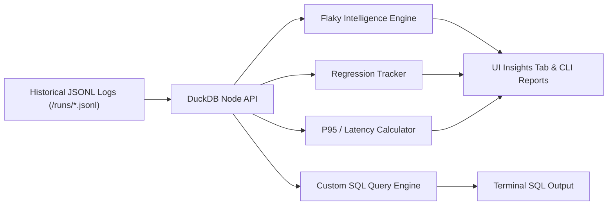

Zen Reporter features an embedded analytics engine powered by [DuckDB](https://duckdb.org/) (`@duckdb/node-api`). By querying historical JSONL run logs, DuckDB delivers instant insights into test suite stability, flakiness, and performance regressions directly from your terminal or UI dashboard.

---

## ⚡ DuckDB Analytics Engine Overview



---

## 📊 Analytical Intelligence Modules

### 1. Flaky Test Intelligence (`npx zr history flaky`)

Detects test cases that alternate between passing and failing across historical test runs.

- **Criteria**: Flags tests that failed in at least 1 run and passed in at least 1 run.
- **Metrics**: Total runs, failure count, pass count, and retry recovery rate.
- **CLI Command**:
  ```bash
  npx zr history flaky
  ```

### 2. Regression Tracking (`npx zr history regressions`)

Identifies test cases that passed in previous runs but regressed to **Failed** or **Timed Out** in the most recent run.

- **Value**: Separates newly broken features from known broken or flaky tests.
- **CLI Command**:
  ```bash
  npx zr history regressions
  ```

### 3. Slowest Tests Analysis (`npx zr history slow`)

Ranks top slowest test cases based on average duration across all recorded historical runs.

- **Limit Parameter**: Support for custom top-$N$ threshold output (`--limit N`).
- **CLI Command**:
  ```bash
  npx zr history slow --limit 15
  ```

### 4. P95 Duration & Profile Latency

Calculates the 95th percentile execution duration threshold across project profiles to highlight performance outliers.

---

## 💻 CLI Command Reference (`zr history`)

> **Note**: History CLI commands require `@duckdb/node-api` installed as a devDependency in your project.

| Command                           | Description                                                                             |
| :-------------------------------- | :-------------------------------------------------------------------------------------- |
| `npx zr history`                  | List all historical test runs with start time, duration, and pass/fail/skip counts.     |
| `npx zr history runs`             | Same as `npx zr history`. Summarizes all recorded execution runs.                       |
| `npx zr history files`            | Aggregate historical metrics grouped by spec file.                                      |
| `npx zr history tests`            | Granular execution metrics and average durations per test case.                         |
| `npx zr history flaky`            | Identify flaky tests fluctuating between pass and fail.                                 |
| `npx zr history regressions`      | List tests that passed previously but failed in the latest run.                         |
| `npx zr history slow [--limit N]` | Rank top $N$ slowest tests by average execution duration across runs (default: 10).     |
| `npx zr history trend`            | Display historical pass rate percentages per run over time.                             |
| `npx zr history report`           | Execute DuckDB aggregation over `.jsonl` runs and update `history.json` & `index.html`. |
| `npx zr history query "<SQL>"`    | Execute arbitrary SQL queries directly over JSONL run records.                          |

---

## 🔍 Custom SQL Queries Interface (`zr history query`)

You can query your test execution logs directly using standard SQL via DuckDB:

### Example 1: Find tests with average duration greater than 5 seconds

```bash
npx zr history query "SELECT title, file, AVG(duration_ms) / 1000 AS avg_sec FROM runs GROUP BY title, file HAVING avg_sec > 5 ORDER BY avg_sec DESC"
```

### Example 2: Count total failures per project profile across all runs

```bash
npx zr history query "SELECT project, COUNT(*) AS failure_count FROM runs WHERE status IN ('failed', 'timedOut') GROUP BY project ORDER BY failure_count DESC"
```
