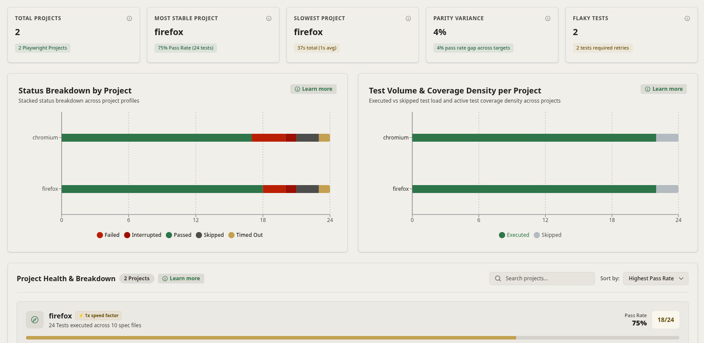
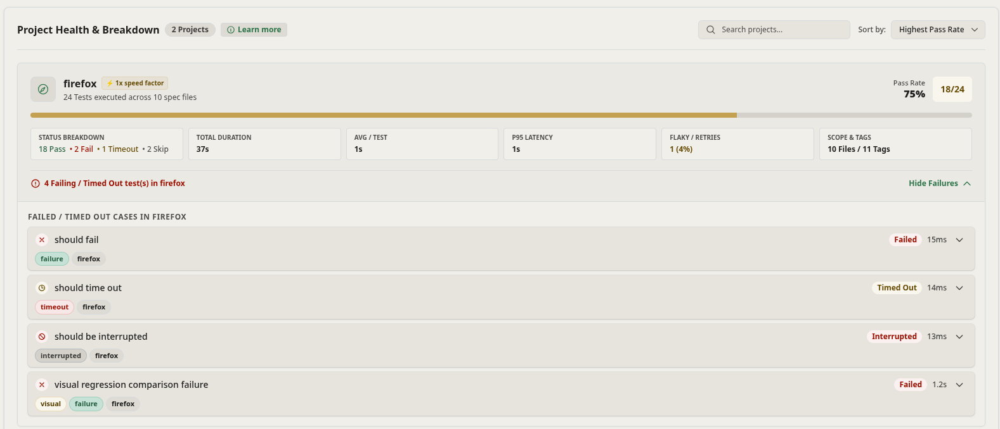

Modern Playwright test suites frequently execute the same test files across multiple project profiles (e.g., Desktop Chrome, Desktop Firefox, Mobile Safari, API Testing). The **Projects** tab in Zen Reporter isolates and compares metrics across each configured Playwright project.



---

## 📊 Projects Tab Overview

```text
┌────────────────────────────────────────────────────────────────────────┐
│                         Per-Project Analytics                          │
├────────────────────────────────────────────────────────────────────────┤
│                       Project Breakdown Summary                        │
│         Total Projects, Most Stable Project, Slowest Project,          │
│              Pass Rate Parity Variance, Total Flaky Tests              │
├────────────────────────────────────────────────────────────────────────┤
│                        Status Distribution Chart                       │
│         Stacked / Grouped Bar Charts of Passed/Failed/Skipped/         │
│                   Interrupted/Timed out per Project                    │
├────────────────────────────────────────────────────────────────────────┤
│                  Volume & Coverage Distribution Chart                  │
│           Comparison of Test Counts and Wall-Clock Durations           │
│                          per Project Profile                           │
├────────────────────────────────────────────────────────────────────────┤
│                          Project Detail Cards                          │
│              Detailed Breakdown Cards per Project Profile              │
│                       with Pass Rate & Duration                        │
└────────────────────────────────────────────────────────────────────────┘
```

---

## 🔍 Key Analytics & Visualizations

### 1. Project Summary Cards

High-level summary metrics at the top of the Projects view:

- **Total Projects**: Total number of Playwright project targets executed in the run.
- **Most Stable Project**: Identifies the project target achieving the highest pass rate percentage.
- **Slowest Project**: Highlights the project profile taking the longest cumulative execution time.
- **Parity Variance**: Measures the pass rate gap percentage across targets to spot cross-browser or cross-environment instability.
- **Total Flaky Tests**: Tracks the total number of test cases across project targets that required retries to pass.

### 2. Status Distribution Chart

- **Interactive Bar Chart**: Visualizes the distribution of test statuses (`Passed`, `Failed`, `Timed Out`, `Skipped`, `Interrupted`) per project profile.
- **Hover Insights**: Hovering over any bar displays exact test counts for that specific browser profile.
- **Multi-Browser Comparison**: Easily spot issues specific to a single engine (e.g., tests failing only on `webkit` / Mobile Safari).

### 3. Volume & Coverage Distribution

- **Volume vs. Duration**: Plots both test case count and cumulative execution duration for each project.
- **Bottleneck Identification**: Identifies browser profiles taking disproportionately longer execution times despite having identical test counts.

### 4. Project Detail Cards

Comprehensive standalone cards for every Playwright project profile under the **Project Health & Breakdown** view:

- **Search & Sort Controls**: Filter project cards by name via the search input or sort them using metrics such as Highest Pass Rate.
- **Project Header & Pass Rate Progress Bar**: Displays project profile name, speed factor badge, total tests executed across spec files, and pass rate percentage badge with a color-coded visual progress bar.
- **Metrics Grid**: Standardized metric breakdown cards for each project:
  - **Status Breakdown**: Color-coded counts of Passed, Failed, Timed Out, and Skipped tests.
  - **Total & Average Duration**: Total execution duration and average runtime per test case.
  - **P95 Latency**: 95th percentile latency benchmark.
  - **Flaky / Retries**: Count and percentage of tests requiring retries to pass.
  - **Scope & Tags**: Total spec files and distinct tags associated with the project.
- **Inline Collapsible Failure Breakdown**: Expandable list displaying failing, timed out, and interrupted test cases per project with status tags, execution runtimes, and direct inspection options.



---

## 💡 Practical Use Cases

- **Cross-Browser Compatibility Testing**: Instantly isolate whether a failure is an application bug (failing across Chromium, Firefox, and Webkit) or a browser-specific visual engine glitch (failing only on Webkit).
- **Mobile Viewport Analysis**: Compare desktop execution metrics against mobile responsive viewport profiles (`Mobile Chrome`, `iPhone 13`).
- **Parallel Worker Optimization**: Identify heavy projects that stall overall CI execution time and move them to dedicated worker pools.
