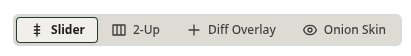
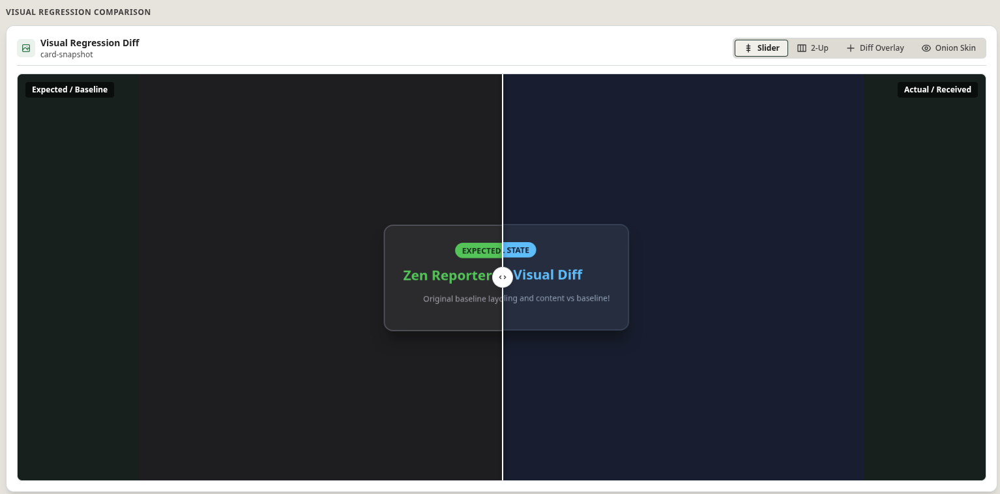
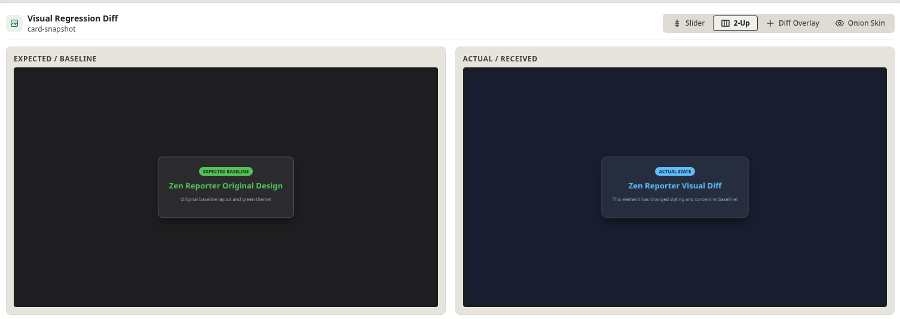
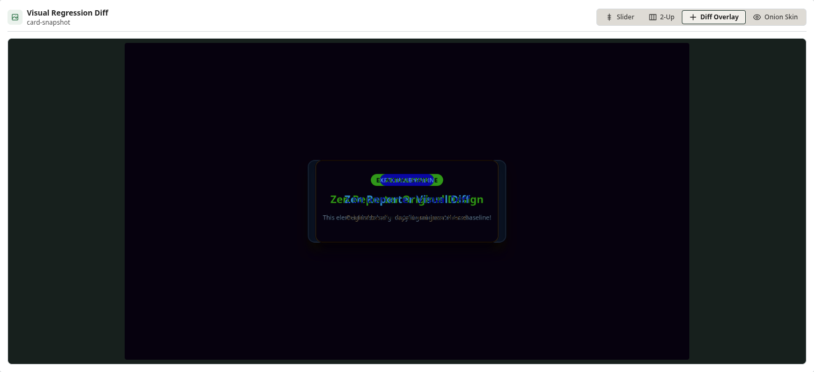
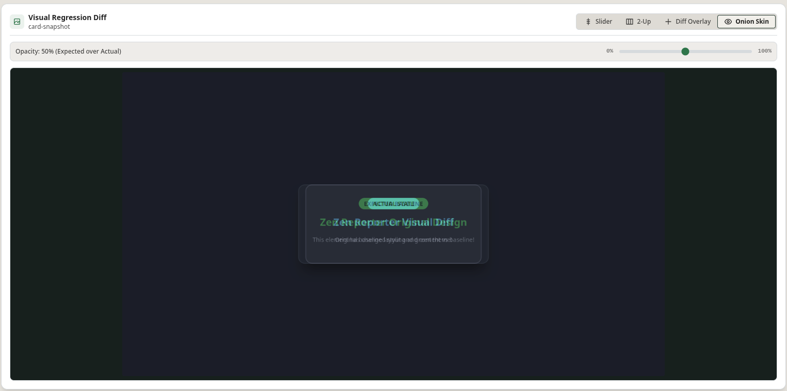

Playwright screenshot assertion tests (`expect(page).toHaveScreenshot()`) generate image comparison attachments when visual diffs occur. Zen Reporter embeds a dedicated **Visual Regression Diff Viewer** directly within the test detail modal.

---

## 🖼️ Comparison View Modes

When a visual regression failure occurs, Zen Reporter automatically extracts image attachment pairs (`actual` / received, `expected` / baseline, and `diff`) and presents 4 interactive inspection modes via top toolbar buttons: Slider, 2-Up, Diff Overlay and Onion Skin.

<div align="center">



</div>

---

## 🔍 Detailed View Modes

### 1. Interactive Image Slider (`Slider`)

- **Interactive Split-Screen**: Superimposes the Expected (Baseline) and Actual (Received) images directly on top of each other with a central draggable vertical divider handle `< >`.
- **Precision Drag Inspection**: Drag the slider handle horizontally across the viewport canvas to continuously reveal pixel-perfect differences between baseline and actual test snapshots.



### 2. Side-by-Side 2-Up Viewer (`2-Up`)

- **Dual-Pane Grid Layout**: Displays the **Expected / Baseline** image and **Actual / Received** image side-by-side in synchronized image frames.
- **Use Case**: Enables quick side-by-side visual comparison of structural layout shifts, element positioning changes, or broad content updates across viewports.



### 3. Difference Highlight Overlay (`Diff Overlay`)

- **Pixel Difference Overlay**: Superimposes Expected and Actual image layers with highlights to clearly distinguish baseline elements from actual test output.
- **Visual Error Isolation**: Instantly pinpoints exact pixel-level color, text, or boundary deviations that caused screenshot assertion failures.



### 4. Onion Skin Transparency Blend (`Onion Skin`)

- **Variable Opacity Blending**: Blends the Actual / Received image over the Expected / Baseline image using an interactive transparency slider.
- **Subtle Shift Detection**: Allows smooth opacity fading between baseline and current state to detect subtle element misalignments, font weight shifts, or padding changes.



---

## 💡 Configuring Playwright for Visual Regression

To ensure visual diff attachments are captured by Zen Reporter, configure Playwright screenshot assertions in your specs:

```typescript
import { test, expect } from '@playwright/test';

test('Homepage visual regression check', async ({ page }) => {
  await page.goto('https://example.com');

  // Captures screenshot and compares against baseline image
  await expect(page).toHaveScreenshot('homepage-baseline.png', {
    maxDiffPixelRatio: 0.05,
  });
});
```

Zen Reporter will automatically detect `.png` / `.jpg` attachments with matching baseline and diff filenames and enable the Visual Diff Viewer.
