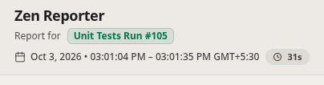
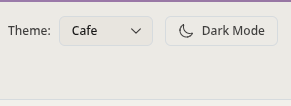
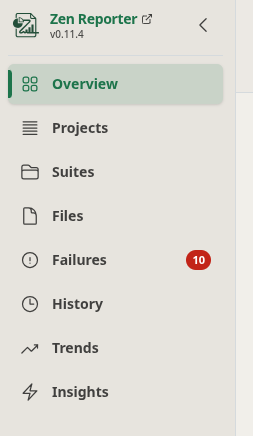
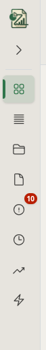
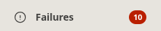
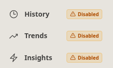
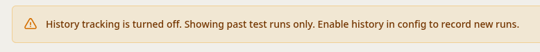

The Zen Reporter dashboard layout is structured around two key persistent components: the **Sticky Header** at the top and the **Left Sidebar Navigation** on the side. Together, they provide context, controls, and seamless navigation across all test execution views.

---

## Part 1: Sticky Header & Global Navigation

The **Sticky Header** (located at the top of the Zen Reporter dashboard) serves as the persistent command bar and metadata anchor for your test execution reports. Pinned permanently to the top of the browser viewport, it ensures your project name, test run name, timing metrics, and display customization controls are always accessible regardless of scroll depth.

|                     Header Left Side                     |                     Header Right Side                      |
| :------------------------------------------------------: | :--------------------------------------------------------: |
|  |  |

---

### 🔍 Header Elements & Key Controls

#### 1. Project & Test Run Branding

- **Project Name Title**: Large bold heading presenting the top-level test project name ([`projectName`](../configuration#2-projectname-string)). Defaults to `"Test Execution Report"` if not configured.
- **Run Identifier Badge**: Styled pill badge displaying the custom test run name ([`testRunName`](../configuration#3-testrunname-string)), such as CI build numbers (`"Build #42"`).

#### 2. Execution Time & Duration Summary

Located below the project title, the header provides instant timing metrics for the run:

- **Date & Time Range**: Displays the start and end timestamp of the test execution.
- **Wall-Clock Duration Pill**: Highlighting total real-world execution duration calculated as:

  > **Wall-Clock Duration** = `End Time - Start Time`

  Formatted concisely as hours, minutes, and seconds (e.g., `12m 45s`).

#### 3. Interactive Theme Selector Dropdown

Enables instant, real-time switching of the report's visual design palette without reloading the page or losing current tab state:

- **`Cafe`** _(Default)_: Warm beige and espresso palette designed for low eye strain.
- **`Concept`**: Minimalist slate and indigo palette tailored for modern software interfaces.
- **`Sentinel`**: High-contrast navy and warning-color scheme, specifically engineered for maximum visibility.

#### 4. One-Click Light / Dark Mode Toggle

A responsive icon button allowing users to switch between Light Mode and Dark Mode dynamically:

- **Sun / Moon Indicators**: Displays a sun icon when in Dark Mode (switching to Light) and a moon icon when in Light Mode (switching to Dark).

---

### ⚙️ Header Configuration in `playwright.config.{js/ts}`

Header metadata and initial theme settings can be pre-configured directly in your Playwright configuration file:

```typescript
import { defineConfig } from "@playwright/test";

export default defineConfig({
  reporter: [
    [
      "@arpanp/zen-reporter",
      {
        projectName: "E2E Web Suite", // Displayed as main header title
        testRunName: "Release v2.4.0", // Displayed in accent badge
        theme: "Concept", // 'Cafe' | 'Concept' | 'Sentinel'
        darkMode: true, // Set initial mode preference
      },
    ],
  ],
});
```

---

### 💡 Key Benefits of the Sticky Header

1. **Persistent Execution Context**: When analyzing long failure stack traces or scrolling through hundreds of test specs, engineers never lose context of which project build or timestamp they are inspecting.
2. **Instant Visual Customization**: Switch between Dark Mode or change visual themes immediately from any tab or scroll position.
3. **Zero-Scroll Context Switching**: Quick diagnostic confirmation of total run duration and completion timestamp available at a glance.

---

## Part 2: Left Sidebar Navigation & Workspace Control

The **Left Sidebar** serves as the primary navigation control center for Zen Reporter dashboards. Pinned to the left side of the screen, it allows QA engineers, developers, and managers to seamlessly toggle between high-level executive metrics, detailed test suite hierarchies, root cause failure traces, and historical analytics.

---

### 📐 Sidebar Layout & Viewport Modes

The sidebar operates in two interactive width modes with smooth transitions:

<div align="center">

|                Sidebar Expanded (default)                 |                          Sidebar Collapsed                           |
| :-------------------------------------------------------: | :------------------------------------------------------------------: |
|  |  |

</div>

- **Expanded Mode**: Displays full tab icons, text labels, failure count badges, and history status badges.
- **Collapsed Mode**: Collapses into an icon-only vertical bar for maximum horizontal dashboard screen real estate. Hovering over icons provides descriptive tooltips.

---

### 🧭 Navigation Tabs Overview

The sidebar provides access to **8 core views** of your test execution setup:

| Tab Icon & Name | View Description                      | Key Functionality                                                                                                                       |
| :-------------- | :------------------------------------ | :-------------------------------------------------------------------------------------------------------------------------------------- |
| **`Overview`**  | High-Level Executive Dashboard        | Run metadata, quick KPI stats, radial pass rate ring, wall-clock duration efficiency, and test stability/flakiness metrics.             |
| **`Projects`**  | Per-Project Multi-Browser Analytics   | Pass rate breakdown across Playwright project configurations (`chromium`, `firefox`, `mobile`), and test volume & coverage per project. |
| **`Suites`**    | Interactive Suite & Spec Explorer     | Expandable `describe` tree structure, full-text search, spec file result summaries, and retry badges.                                   |
| **`Files`**     | Spec File Metrics & Stability         | Spec file health matrix, test counts, execution duration, and stability ratings.                                                        |
| **`Failures`**  | Deep-Dive Root Cause Failure Analysis | Error signatures, step trace highlights (`▶`), code frame snippets, and expected vs. received diffs.                                    |
| **`History`**   | Execution Run Archive Log             | Historical execution log, run-over-run quality ratings (`Excellent`, `Critical`), and wall-clock trends.                                |
| **`Trends`**    | Long-Term Execution Metrics           | Pass rate stability trends, wall-clock trajectory across projects, and test step categories composition.                       |
| **`Insights`**  | DuckDB Embedded Intelligence          | Flaky test detection, regression analysis, top slowest test cases, and P95 latency thresholds.                                          |

---

### 🔔 Dynamic Badges & Indicators

#### 1. Failure Counter Badge

The **Failures** tab features an automated real-time issue badge summarizing total execution anomalies calculated as:

> **Issue Count** = `Failed Tests + Timed Out Tests + Interrupted Tests`

<div align="center">



</div>

- **Expanded Mode**: Displays a solid red badge on the right edge of the tab with the total count (e.g., `10`).
- **Collapsed Mode**: Displays a compact red notification dot pinned to the top-right corner of the warning icon.

#### 2. History Disabled Indicator

<div align="center">



</div>

When historical run archiving is disabled in configuration (`enableHistory: false`), historical analytics tabs (**History**, **Trends**, and **Insights**) display warning badges:

- **Expanded Mode**: Renders an amber pill badge labeled `Disabled` with a warning icon.
- **Collapsed Mode**: Displays an amber exclamation mark badge (`!`) over the respective tab icons.
- **Indicative Warning**: Clicking any disabled history tab shows a warning message at the top of the tab; indicating the need to enable history archiving in `playwright.config.ts` in order to track historical data.



---

### ⚙️ Special Report Modes & Filtering

#### 1. Minimal Report Mode (`minimalReport: true`)

When generating lightweight static reports (`minimalReport: true`), Zen Reporter automatically streamlines the sidebar by removing heavy analytical tabs:

- **Visible Tabs (4)**: `Overview`, `Suites`, `Files`, `Failures`.
- **Hidden Tabs (4)**: `Projects`, `History`, `Trends`, `Insights`.

#### 2. Executive Summary Mode (`summary.html`)

When rendering the standalone executive summary view (`summary.html` or `?view=summary`), the sidebar is **completely suppressed** to present a zero-distraction summary interface.

---

### 🛠️ Sidebar Configuration in `playwright.config.ts`

Control history recording and minimal reporting modes directly in your configuration:

```typescript
import { defineConfig } from "@playwright/test";

export default defineConfig({
  reporter: [
    [
      "@arpanp/zen-reporter",
      {
        enableHistory: true, // Set to false to disable history & show warning badges
        minimalReport: false, // Set to true to filter sidebar to essential tabs only
      },
    ],
  ],
});
```

---

### 💡 Benefits & Ergonomics of Sidebar Navigation

1. **Active State Highlight**: Current tab is highlighted with an inset blue indicator bar along the left edge and background tinting for instant visual feedback.
2. **Keyboard & Tooltip Friendly**: Full ARIA tooltip support in collapsed mode ensures screen readers and keyboard navigation remain accessible.
3. **Zero-Reload Tab Switching**: All tab transitions are powered by React state, eliminating browser page reloads when switching between views.
